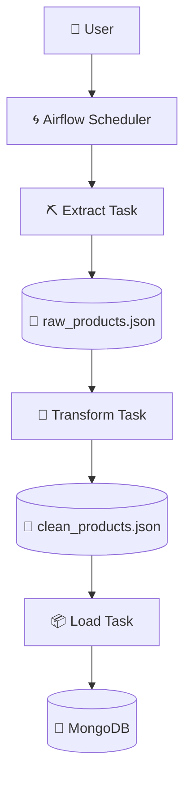

# 📚 Books ETL Pipeline — Airflow + Docker + MongoDB

<p align="center">
  
  
  
  
  
  
</p>

<p align="center">
  An end-to-end, production-style <b>ETL (Extract → Transform → Load)</b> pipeline that scrapes book catalog data from
  <a href="https://books.toscrape.com">books.toscrape.com</a>, cleans and transforms it, and loads it into MongoDB —
  fully orchestrated with Apache Airflow and containerized with Docker.
</p>

---

## 📖 Table of Contents

- [Overview](#-overview)
- [Tech Stack](#-tech-stack)
- [Project Structure](#-project-structure)
- [Pipeline Details](#-pipeline-details)
  - [Extraction](#1️⃣-extraction)
  - [Transformation](#2️⃣-transformation)
  - [Loading](#3️⃣-loading)
- [Airflow DAG](#-airflow-dag)
- [Features](#-features)
- [ETL Workflow Explained](#-etl-workflow-explained)
- [Architecture Diagram](#-architecture-diagram)
- [Setup Guide](#-setup-guide)
- [Challenges & Solutions](#-challenges--solutions)
- [Learning Outcomes](#-learning-outcomes)
- [Future Improvements](#-future-improvements)
- [License](#-license)

---

## 🧭 Overview

This project was built as part of a **Data Engineering / GenAI internship assignment**, with the goal of designing a
robust, idempotent ETL pipeline that automates data collection from an e-commerce-style catalog for downstream
catalog and pricing analysis.

The pipeline targets **[books.toscrape.com](https://books.toscrape.com)**, a sandbox e-commerce site built for
scraping practice, and walks through the full lifecycle of a real ETL system:

```
Extract  →  Transform  →  Load
(Scrape)     (Clean)       (MongoDB)
```

Every stage is implemented as an independent, testable Python script, orchestrated by an Airflow DAG, and the entire
stack runs inside Docker containers for reproducibility.

---

## 🛠 Tech Stack

| Category            | Tools / Libraries              |
|----------------------|--------------------------------|
| Language             | Python 3                       |
| Orchestration        | Apache Airflow 3.x              |
| Containerization      | Docker Desktop, Docker Compose |
| Database              | MongoDB                        |
| Web Scraping          | Requests, BeautifulSoup4       |
| Database Driver       | PyMongo                        |
| Data Interchange      | JSON                           |
| Observability         | Python `logging` module         |

---

## 📁 Project Structure

```
.
├── Airflow/
│   ├── dags/
│   │   └── ecommerce_etl_dag.py     # Main Airflow DAG definition
│   └── docker-compose.yaml          # Airflow + services orchestration
│
├── Scripts/
│   ├── extraction.py                # Extract stage (scraper)
│   ├── transform.py                 # Transform stage (cleaning)
│   └── load.py                      # Load stage (MongoDB writer)
│
├── data/
│   ├── raw_products.json            # Raw scraped output
│   └── clean_products.json          # Cleaned, transformed output
│
└── README.md
```

---

## ⚙️ Pipeline Details

### 1️⃣ Extraction

`Scripts/extraction.py` is responsible for pulling raw product data directly from the source site.

- Scrapes **all 50 catalogue pages** on books.toscrape.com.
- Collects data for approximately **~1,000 books**.
- Automatically follows the **"Next"** pagination link until the last page is reached — no hardcoded page count.
- Extracts the following fields per book:

| Field | Field | Field |
|---|---|---|
| Title | Description | Price |
| Original Price | Image URL | Availability |
| Rating | Variants | Product URL |
| Category | UPC | Product Type |
| Price (Excl. Tax) | Price (Incl. Tax) | Tax |
| Number of Reviews | Stock Count | |

**Implementation notes:**
- Built with `requests` + `BeautifulSoup4` for HTML parsing.
- Custom **request headers** (User-Agent, Accept-Language) to mimic a real browser session.
- **Retry logic** wraps each HTTP call to gracefully recover from transient network failures.
- **Randomized, polite delays** are inserted between requests to avoid hammering the target server.
- All actions (page fetched, retry triggered, item parsed, failures) are recorded via the `logging` module.
- Final output is persisted to `data/raw_products.json`.

### 2️⃣ Transformation

`Scripts/transform.py` reads the raw extraction output and converts it into a clean, analysis-ready dataset.

- Loads `raw_products.json`.
- Strips and normalizes **whitespace** across all text fields.
- Converts price strings (e.g. `£51.77`) into proper **float** values.
- Converts the star-rating from word form (`"Three"`) into an **integer** (`3`).
- Converts the availability string into a **boolean** (`in_stock: true/false`).
- Extracts the numeric **stock count** from strings like `"In stock (22 available)"`.
- Converts the review count text into an **integer**.
- Applies **safe fallback handling** for missing or malformed values so a single bad record never crashes the run.
- Organized into small, single-responsibility **helper functions** for readability and testability.
- Wrapped in **try/except** blocks with structured logging for every transformation step.
- Writes the result to `data/clean_products.json`.

### 3️⃣ Loading

`Scripts/load.py` takes the cleaned dataset and persists it into MongoDB.

- Reads `clean_products.json`.
- Connects to a MongoDB instance using **PyMongo**.
- Creates a **unique index on `UPC`** to enforce record uniqueness at the database level.
- Uses `UpdateOne(..., upsert=True)` for every record instead of a plain insert.
- Batches all operations into a single **`bulk_write()`** call for performance.
- Because of the upsert-based design, **re-running the load stage never creates duplicates** — the pipeline is
  fully **idempotent**.
- Logs a summary of inserted vs. updated document counts after each run.
- Wrapped in robust exception handling to catch connection drops, write errors, and index conflicts.

---

## 🌀 Airflow DAG

The pipeline is orchestrated by a single DAG — `ecommerce_etl_dag.py` — that models the ETL process as three
sequential tasks:

```
Extract  →  Transform  →  Load
```

**DAG design highlights:**

| Aspect | Detail |
|---|---|
| Operator | `BashOperator`, each task invokes its corresponding Python script |
| Task dependency | Strictly sequential — `extract >> transform >> load` |
| Retries | Each task is configured with automatic **retries** on failure |
| Retry delay | A fixed **retry delay** is applied between attempts to avoid immediate re-hammering |
| Scheduling | Supports a defined **schedule interval** for periodic, automated runs |
| Manual trigger | Can also be triggered on-demand from the Airflow UI or CLI |
| Logging | Every task step streams logs to the Airflow task log for full traceability |
| Design | Kept **modular** — the DAG only orchestrates; all business logic lives in `Scripts/` |

Because each stage is a standalone script invoked via `BashOperator`, the same extraction, transformation, and
loading logic can also be run and debugged **outside of Airflow**, which was extremely useful during development.

---

## ✨ Features

- 🧩 **Modular ETL architecture** — extract, transform, and load are fully decoupled scripts
- 🐳 **Dockerized workflow** — the entire Airflow stack runs via Docker Compose
- ⏱ **Automated Airflow orchestration** — scheduled and manually-triggerable DAG runs
- 🔁 **Retry mechanism** — automatic retries with delay at both the scraping and DAG level
- 📝 **Logging** — structured logs across every stage of the pipeline
- ♻️ **Idempotent loading** — safe to re-run without creating duplicate records
- 🍃 **MongoDB integration** — unique-indexed, upsert-based persistence layer
- 🧹 **Clean code structure** — small, single-purpose, well-named functions
- 🔐 **Separation of concerns** — orchestration (Airflow) is fully decoupled from logic (Scripts)
- ⚠️ **Error handling** — try/except coverage across network, parsing, and DB operations
- ✅ **Data validation** — type coercion and missing-value handling during transformation
- 📈 **Scalable design** — new fields, sources, or destinations can be added with minimal changes

---

## 🔄 ETL Workflow Explained

Here's what happens internally, step by step, once the DAG is triggered:

1. **Trigger** — The Airflow Scheduler (or a manual trigger) starts a new DAG run.
2. **Extract task fires** — `extraction.py` runs inside its `BashOperator` task. It requests page 1 of the catalog,
   parses every book on the page, and follows the "Next" link until all 50 pages are exhausted.
3. **Raw data written** — All scraped records are serialized to `data/raw_products.json`.
4. **Transform task fires** — Once extraction succeeds, Airflow triggers `transform.py`. It reads the raw JSON,
   applies cleaning and type-conversion functions to every record, and skips/flags malformed entries without
   halting the run.
5. **Clean data written** — The cleaned dataset is saved to `data/clean_products.json`.
6. **Load task fires** — Airflow triggers `load.py`, which connects to MongoDB, ensures the unique index on `UPC`
   exists, and performs a single `bulk_write()` of upsert operations.
7. **Persistence complete** — MongoDB now contains the latest catalog snapshot; existing records are updated
   in-place and new ones are inserted, with zero duplication.
8. **Run completion** — Airflow marks all three tasks as `success`, and logs from every stage are available in the
   Airflow UI for inspection.

If any task fails at any point, Airflow automatically retries it according to the configured retry policy before
marking the run as failed — the pipeline never silently loses data.

---

## 🗺 Architecture Diagram



---

## 🚀 Setup Guide

### 1. Clone the repository

```bash
git clone https://github.com/<M-Wasil>/books-etl-pipeline.git
cd books-etl-pipeline
```

### 2. Create a virtual environment

```bash
python3 -m venv venv
source venv/bin/activate      # On Windows: venv\Scripts\activate
```

### 3. Install requirements

```bash
pip install -r requirements.txt
```

### 4. Install Docker Desktop

Download and install Docker Desktop for your OS from [docker.com](https://www.docker.com/products/docker-desktop/),
then confirm it's running:

```bash
docker --version
docker compose version
```

### 5. Start Airflow using Docker Compose

```bash
cd Airflow
docker compose up -d
```

This spins up the Airflow webserver, scheduler, and metadata database as containers.

### 6. Access the Airflow UI

Open your browser and navigate to:

```
http://localhost:8080
```

Log in with the default credentials (as configured in `docker-compose.yaml`, typically `airflow` / `airflow`).

### 7. Configure MongoDB

Make sure MongoDB is reachable from the Airflow containers (e.g. via a `mongo` service in the same Docker network,
or an external connection string). Update the connection URI in `Scripts/load.py` or via environment variables as
needed:

```bash
export MONGO_URI="mongodb://localhost:27017"
```

### 8. Trigger the DAG

From the Airflow UI, enable `ecommerce_etl_dag` and click **Trigger DAG**, or trigger it via CLI:

```bash
docker compose exec airflow-scheduler airflow dags trigger ecommerce_etl_dag
```

### 9. Verify the output JSON files

```bash
ls -lh ../data/
cat ../data/clean_products.json | head -n 20
```

### 10. Verify the MongoDB data

```bash
mongosh "mongodb://localhost:27017"
use books_db
db.products.countDocuments()
db.products.findOne()
```

---

## 🧩 Challenges & Solutions

| Challenge | Solution |
|---|---|
| **SSL certificate verification inside Docker** | The Airflow container's CA bundle was outdated/incomplete, causing `requests` SSL errors. Resolved by updating the base image's `ca-certificates` package during the Docker build step. |
| **Relative URL handling** | Book detail and image links on the site are relative (e.g. `../../images/...`). Solved using `urllib.parse.urljoin()` combined with a tracked "current page" base URL, so every link resolves correctly regardless of catalog depth. |
| **Pagination across 50 pages** | Rather than hardcoding page numbers, the scraper parses the "Next" button's `href` on each page and loops until it's no longer present — making the crawler resilient to catalog size changes. |
| **Docker volume mapping** | Early on, `data/` files written inside the container weren't visible on the host. Fixed by explicitly mounting the project's `data/` and `Scripts/` directories as volumes in `docker-compose.yaml`. |
| **MongoDB connectivity from the Airflow container** | `localhost` inside a container doesn't refer to the host machine. Fixed by connecting to MongoDB via its **service name** on the shared Docker network (or `host.docker.internal` when running Mongo on the host). |
| **Preventing duplicate records** | Re-running the DAG for testing was inserting duplicate books. Solved by creating a **unique index on `UPC`** and switching all inserts to `UpdateOne(..., upsert=True)`, making the load stage idempotent. |
| **Data cleaning & encoding issues** | Some descriptions contained HTML entities and inconsistent whitespace/encoding. Resolved with explicit UTF-8 handling and text-normalization helper functions during the transform stage. |

---

## 🎓 Learning Outcomes

Working through this assignment reinforced several core data engineering concepts:

- Designing and reasoning about **ETL architecture** as three independently testable stages.
- Orchestrating multi-step pipelines with **Apache Airflow**, including DAG design, retries, and scheduling.
- Building and networking multi-service environments with **Docker** and Docker Compose.
- Practical **web scraping** techniques: pagination handling, headers, delays, and retry logic.
- Writing robust **data transformation** logic with type coercion and missing-value handling.
- Performing efficient, duplicate-safe **MongoDB operations** (indexing, upserts, bulk writes).
- Instrumenting a pipeline end-to-end with **structured logging**.
- Designing for failure with proper **error handling** at every stage.
- Understanding what it actually takes to make a pipeline **idempotent** in practice, not just in theory.

---

## 🔮 Future Improvements

- 🗄 Add **PostgreSQL** as an alternative structured storage backend
- ➕ Implement **incremental loading** based on last-modified/updated timestamps
- ☁️ Add **S3 integration** for raw/clean data archiving
- 🕷 Rebuild the extraction layer using **Scrapy** for better concurrency and throttling control
- 🎭 Add **Selenium/Playwright** support for JavaScript-rendered target sites
- 🧪 Introduce **unit tests** for transformation and loading functions
- 🔄 Set up **CI/CD** (GitHub Actions) to lint, test, and validate the DAG on every push
- 🔑 Move secrets and connection strings into **environment variables** / a `.env` file
- 📊 Add **monitoring and alerting** (e.g. Airflow SLAs, Slack/email notifications on failure)

---

## 📄 License

This project is released under the [MIT License](LICENSE).

---

<p align="center">Built as part of a Data Engineering internship assignment 🚀</p>
